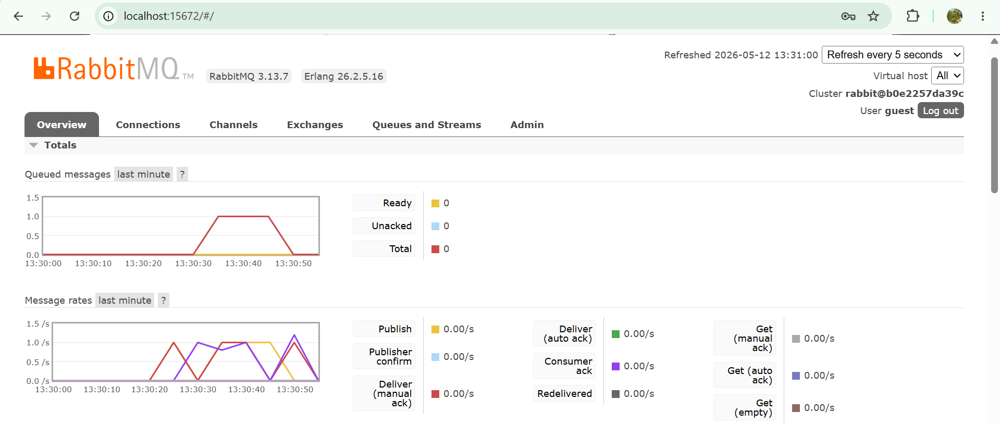

# Module-9-SoftwareArchitecture
adpro stuff

## What is amqp
> amqp is advanced message queueing protocol a kind of messaging protocol,

## What does it mean? guest:guest@localhost:5672 , what is the first guest, and what is the second guest, and what is localhost:5672 is for?
> so amqp is a protocol for message passing. It sends messages with high performance and reliability. the first and second "guest" are the username and password respectively, while localhost:5672 tells us that it is running on the local machine, on port 5672.

## Slow Subscriber
> 
> The number of queued messages is at 1 for me because it takes roughly 5 seconds for the publisher cargo run to run from start to finish, and the publisher publishes 5 messages in that time, then the subscriber takes one message in each sentence. So every second, a messag gets sent to the queue, and another gets taken from the queue, which is why the number of messages in the queue stays constant at 1.