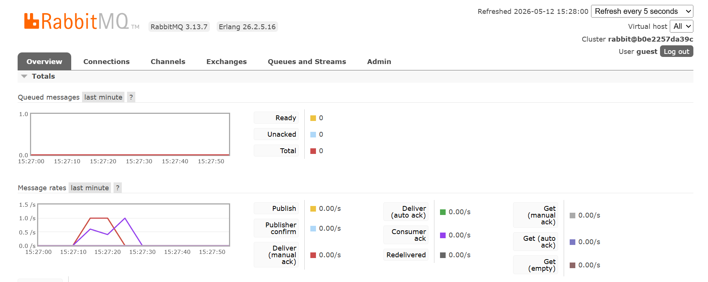
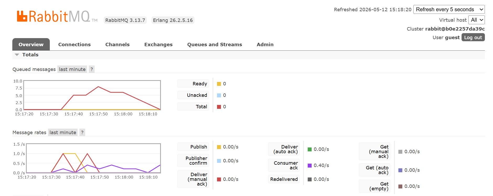
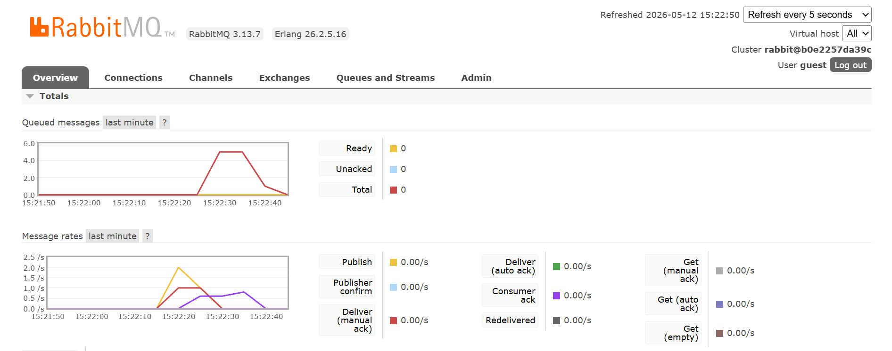

# Module-9-SoftwareArchitecture
adpro stuff

## What is amqp
> amqp is advanced message queueing protocol a kind of messaging protocol,

## What does it mean? guest:guest@localhost:5672 , what is the first guest, and what is the second guest, and what is localhost:5672 is for?
> so amqp is a protocol for message passing. It sends messages with high performance and reliability. the first and second "guest" are the username and password respectively, while localhost:5672 tells us that it is running on the local machine, on port 5672.

## Slow Subscriber
> 
> The number of queued messages is at 1 for me because it takes roughly 5 seconds for the publisher cargo run to run from start to finish, and the publisher publishes 5 messages in that time, then the subscriber takes one message in each sentence. So every second, a messag gets sent to the queue, and another gets taken from the queue, which is why the number of messages in the queue stays constant at 1.

## Running 3 Subscribers at once
### Before :
> 
### After :
> 
> As seen in these pictures, in the message queue, the number of queued message is constantly at 0 because everytime a message is queued, there are always subscribers that are free to take it immediately. 
>
> So i made another test by slowing down the subscribers further, so that there will be a time when no threads are available to take a message immediately after it was queued. 
### Before :
> 
### After :
> 
> As seen in those pictures the number of messages in the queue decreased much faster because there are more subscribers to take the messages.
>
>
## Improvements :
> In the subscriber parts, think the now variable could be used or deleted if not used, which i will. Not much else to say really